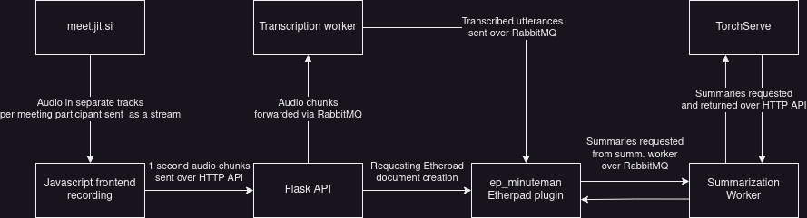

Minuteman is a tool to help users with meeting minuting (producing a summary of the meeting). It works with the JitSi meeting platform. The user connects the tool to a meeting, a transcript is generated and meeting minutes are iteratively being created. An example instance is available at `minuteman.kmjec.cz`. Currently supported languages are: English and we are working on supporting Czech.

## User documentation
On the app main page, you will be greeted with instruction and a possibility to create a new session. Upon creating the session, you will be taken to a new page with a control bar and two editors. The control bar has an input field for you to enter a Jitsi room name. When you enter a room name from `meet.jit.si` and hit `Select room`, a new meeting member will pop up in the meeting. It will record all the audio from the meeting participants and transcribe it in real time. The resulting transcript will appear live in the left editor.

Once enough transcript data has been accumulated, summary bullet points will start appearing in the right editor. These bullet points are generated by a BART summarization model. If you want to summarize a particular part of the meeting, you can highlight it in the transcript editor and press `Ctrl + Alt + S`. This will send the highlighted text to the summarization model and create a bullet point in the summary editor.

As the transcription mechanism is not perfect, you may want to edit the transcript. You can do that freely. The summary bullet points that correspond to the edited text will be updated accordingly. If you want to edit the summary bullet points, you can do that too. Once you edit a bullet point, it will be frozen and will not be updated again even if the corresponding part of the transcript has been edited.

When you are done with the meeting, you can press the disconnect button in the control bar.

If you want to invite meeting participants into the session, just send them the link you are connected to. They will be able to correct the transcript together with you. Just warn them not to connect the tool again; that would mean two clients would be recording the meeting in paralell, resulting in a double transcription.

## Developer documentation
The application is designed in accordance with microservice principles. There are seven components:

* The javascript frontend for recording the meeting located in `flask/static`
* A Python Flask API in `flask` providing the gateway API for the application
* An Etherpad editor plugin in `etherpad-lite`
* A RabbitMQ messaging system in `rabbitmq`
* A transcription worker in `transcription_worker` handling transcription of audio chunks comming from the Flask frontend
* A summarization worker in `summarization_worker`
* A TorchServe backend in `torchserve` responsible for running summarization models.

The architecture and interaction is depicted in the chart below:

When the user first opens the application page, a random 20-character long session identifier `session_id` is created. Two documents are then created in Etherpad: one with a `[session_id]`.trsc identifier for transcript storage and one with a `[session_id]`.summ for created summary points. We store the `session_id` in database to prevent double use of one identifier.

When the setup step is complete, the user can connect the app to a meeting. Audio data is then sent to the Flask frontend, which processes the request and forwards the audio data to RabbitMQ. Audio data is processed by the transcription worker, which transcribes the audio and sends the produced utterances to the Etherpad editor plugin. The plugin saves the utterances to the editor, marking them with their sequence number in the editor. When enough utterances have been accumulated in the editor, it sends a request to the summarization worker with the section of the transcript which it wants summarized.

### Audio frontend
Sound recording is handled from the Javascript code in `flask_frontend/static` part of the project. Dependencies are managed through `npm` and the code with dependencies is packed into two files using `webpack`. A single exception to the dependency management is the `lib-jitsi-meet` library that is not up to date in the node package index and is distributed through a link.

The source is split into four files: `index.js`, `MeetingRecorder.js`, `TrackRecorder.js` and `VoiceRecorder.js`. The `index.js` file contains the entry point for the app. We use the `lib-jitsi-meet` library to connect to the Jitsi meeting on user request; the code handling the connection and user joining is placed in the `MeetingRecorder` class. A `TrackRecorder` object is  created for each audio track,. Each of the recorders creates its own `VoiceRecorder` audio worklet for recording audio data in floats, and connects the audio track from the meeting to it. Audio worklets are a method for Javascript audio processing to run in separate threads and not block UI processing. `VoiceRecorder` needs to be included as a separate module, therefore we bundle it into a separate file for serving.

Audio data is collected at the default sample rate from Jitsi and is then decimated using the `@alexanderolsen/libsamplerate-js` library to 16000Hz. Recorded one-second long chunks are sent to the `TrackRecorder` object from the `VoiceRecorder` and then sent over a HTTP API to the Flask API. They are accompanied with the `TrackRecorder` `recorder_id`, which uniquely identifies an audio track in a meeting, and `session_id`, which identifies the session.

When implementing the recorders, we ran into compatibility issues across Firefox and Chrome browsers, with VoiceRecorder only recording zeros in Chrome-based browsers. We found out that Web Audio API in Chrome requires the track to be connected to an audio element for data to flow from the audio tracks into the recorders. This does not happen in Firefox, where the audio is streamed through the Web Audio API processing graph even upon not playing on the page. We work around this by creating muted audio elements in the page when a new audio track is added.
 processing to run in different threads, thus they are not slowing down the main thread handling the user interface.

### Flask API
The Flask API handles requests from the clients' browsers. It has three main responsibilities:
* creating the editors and initializing a session when a user creates one
* forwarding audio chunks sent by the frontend to RabbiMQ for transcription
* handling changes in the application config and forwarding requests to change to other components (mainly the editor)

## Running the application
TODO

## Configuration in docker-compose.yml
TODO

## Adding a new transcription worker
TODO

## Adding a new summarization worker
TODO

## Adding a new model to TorchServe
TODO
 
